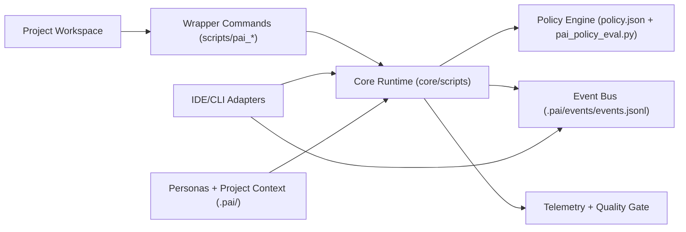
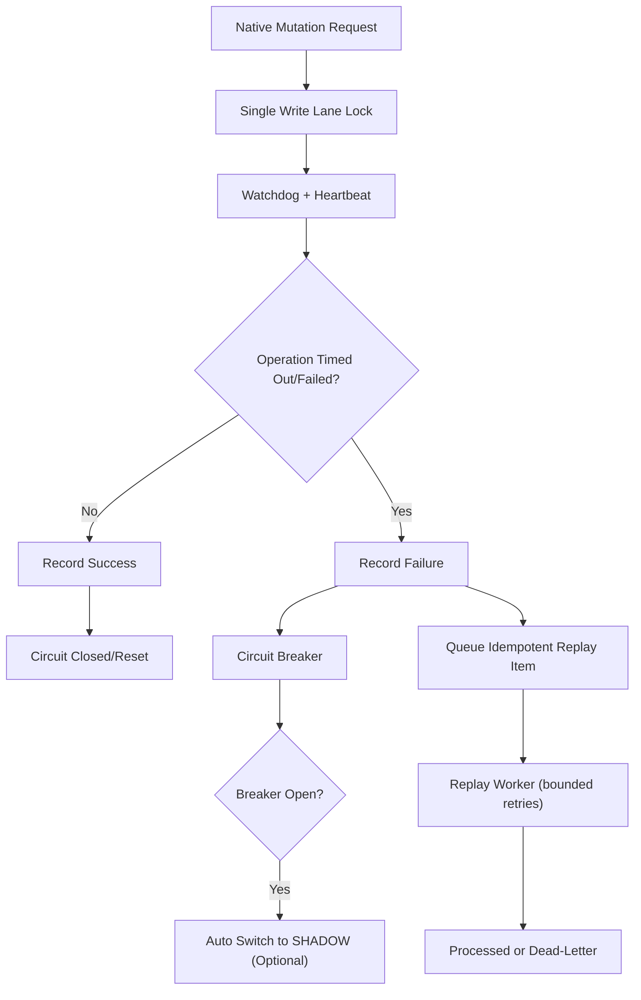

# portable-pai-core

Modular, IDE-agnostic orchestration framework for AI-assisted software delivery.

`portable-pai-core` gives you a portable control plane for:
- runtime safety profiles (`SHADOW` / `NATIVE`)
- structured policy enforcement for parent/sub-agent execution
- event telemetry and quality gates
- adapter contracts for IDE-specific integrations without core lock-in

## Why this exists
Most AI workflows break when moving between IDEs, CLIs, or projects. This framework separates:
- **Core guarantees** (policy, telemetry, quality, orchestration safety)
- **Adapter enhancements** (native hooks, notifications, panels, approvals)

So teams can keep one reliable system across different tooling stacks.

## Architecture



## Native Artifact Safety Flow



## Repository Layout

```text
portable-pai-core/
  adapters/
    CONTRACT.md
    claude/
    codex/
    cursor/
    cli/
    opencode/
  core/
    scripts/
    config/
    schemas/
  docs/
  scripts/
    init-project.sh
  tests/
```

## Core Concepts
- **Profile**: `SHADOW` (safe default) or `NATIVE` (explicitly enabled)
- **Sub-agent modes**: `single_parent`, `proposal_only`, `scoped_write`
- **Policy-first execution**: child commands are evaluated before spawn
- **Event bus**: normalized events emitted to JSONL for audit/automation
- **Quality gate**: KPI-driven pass/fail with stage awareness
- **Native artifact safety stack**:
  - single-lane mutation lock (`pai_native_mutation.sh`)
  - timeout watchdog + circuit breaker (`pai_native_circuit.sh`)
  - idempotent retry/replay queue (`pai_native_replay.sh`)

## Quick Start (Any Project)

From this repo root:

```bash
bash scripts/init-project.sh --project /path/to/your-project
```

This will:
1. create `.pai/config` in the target project
2. install `runtime.env` + `policy.json`
3. create compatibility wrappers in target `scripts/`

Then in target project:

```bash
scripts/pai_runtime_guard.sh status
scripts/pai_telemetry_report.sh
scripts/pai_quality_gate_eval.sh
```

## Configuration
Primary config lives in target project:
- `.pai/config/runtime.env`
- `.pai/config/policy.json`

Important runtime knobs:
- `PAI_KPI_WINDOW_MODE=rolling|lifetime`
- `PAI_KPI_WINDOW_SIZE=<N>`
- `PAI_KPI_INCLUDE_RECONCILED=0|1`
- `PAI_QUALITY_REFRESH_TELEMETRY=0|1`

## Adapter Model
Adapters must comply with [adapters/CONTRACT.md](adapters/CONTRACT.md).

Core policy decisions must remain authoritative; adapters may only add native productivity features.

## Validation

In integrated project repos (where wrappers are installed), run:

```bash
npm run test:portable
bash scripts/pai_pilot_preflight.sh
```

## Deploy as Public Repo

```bash
cd portable-pai-core
git init
git add .
git commit -m "Initial portable-pai-core release"
git branch -M main
git remote add origin git@github.com:<your-org>/portable-pai-core.git
git push -u origin main
```

If using GitHub CLI:

```bash
cd portable-pai-core
gh repo create <your-org>/portable-pai-core --public --source=. --remote=origin --push
```

## Rollout Strategy
1. Pilot in one project (done: Portfolio-Fetch)
2. Extend to `moltbot`
3. Extend to `agentic-memory-scaling`
4. Global rollout

## License
MIT
